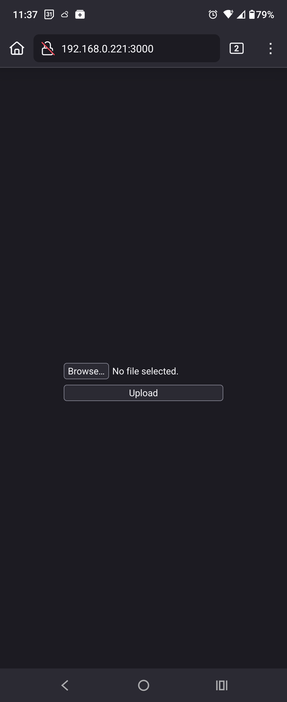

# Quick Upload 

Quickly upload files from one computer to another.

<picture>
	
</picture>

> [!CAUTION]
> This program has ZERO security. Do not use over the internet, don't expose the port 3000 while program is in use.

1. First install dependencies: `npm i`
2. Then run: `node server.js`. Now this computer will receive files from other computers.
3. Now, open your terminal. If on Linux, type `ifconfig`, to find your computer's local IP address. If on Windows, type `ipconfig`.
4. On your other computer or phone: open a web browser, and navigate to the IP address found above.
5. Finally, upload your files! If the host computer is on Windows, it will automatically open Explorer to the uploaded file. Files are saved in `./upload`.
